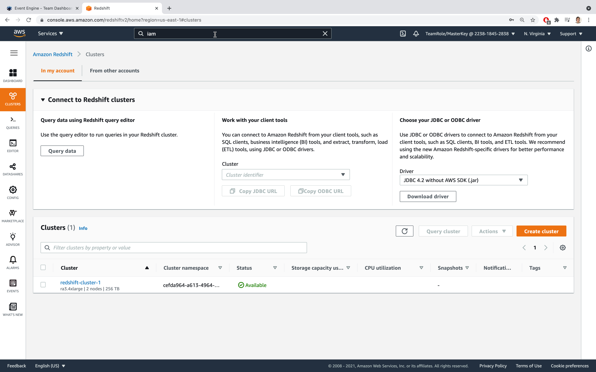

# Fivetran Dev Day
|  | 
|:--:| 

# Hands On Guide

## Table of Contents
1. [Event Engine](#event)
2. [Redshift](#redshift)
3. [Fivetran](#fivetran)
4. [Redshift ML](#ml)

### Event Engine  

|  | 
|:--:| 
| *A OTP via email is the preferred method for this Dev Day* |

|  | 
|:--:| 
| *A password will be sent you the email specified to access free, temporary AWS services via Event Engine* |

|  | 
|:--:| 
| *Enter the code sent from no-reply@us-east-1.otp.signin.aws.training* |

|  | 
|:--:| 
| *This walkthrough will take place in the AWS Console and at Fivetran.com* |

|  | 
|:--:| 

|  | 
|:--:| 
| *Select Redshift in Recently visited services, or via search* |

### Redshift  

|  | 
|:--:| 
| *1* |

|  | 
|:--:| 
| *2* |

|  | 
|:--:| 
| *3* |

|  | 
|:--:| 
| *4* |

|  | 
|:--:| 
| *5* |

|  | 
|:--:| 
| *6* |

|  | 
|:--:| 
| *7* |

|  | 
|:--:| 
| *8* |

|  | 
|:--:| 
| *9* |

|  | 
|:--:| 
| *10* |

|  | 
|:--:| 
| *11* |

|  | 
|:--:| 
| *12* |

|  | 
|:--:| 
| *13* |

|  | 
|:--:| 
| *14* |

|  | 
|:--:| 
| *15* |

|  | 
|:--:| 
| *16* |

|  | 
|:--:| 
| *17* |

|  | 
|:--:| 
| *18* |

|  | 
|:--:| 
| *19* |

|  | 
|:--:| 
| *20* |

|  | 
|:--:| 
| *21* |

|  | 
|:--:| 
| *22* |

|  | 
|:--:| 
| *23* |

|  | 
|:--:| 
| *24* |

### Fivetran 

|  | 
|:--:| 
| *1* |

|  | 
|:--:| 
| *2* |

|  | 
|:--:| 
| *3* |

|  | 
|:--:| 
| *4* |

|  | 
|:--:| 
| *5* |

|  | 
|:--:| 
| *6* |

|  | 
|:--:| 
| *7* |

|  | 
|:--:| 
| *8* |

|  | 
|:--:| 
| *9* |

|  | 
|:--:| 
| *10* |

|  | 
|:--:| 
| *11* |

|  | 
|:--:| 
| *12* |

|  | 
|:--:| 
| *13* |

|  | 
|:--:| 
| *14* |

|  | 
|:--:| 
| *15* |

### Redshift ML 

|  | 
|:--:| 
| *1* |

|  | 
|:--:| 
| *2* |

|  | 
|:--:| 
| *3* |

|  | 
|:--:| 
| *4* |

|  | 
|:--:| 
| *5* |

|  | 
|:--:| 
| *6* |

