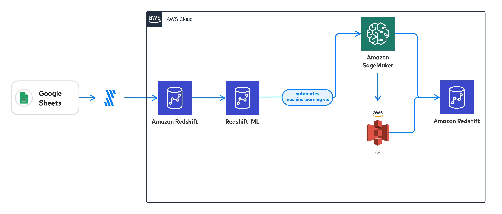

# Fivetran Dev Day
|  | 
|:--:| 

# Hands On Guide
This guide walksthrough how to use Fivetran, Redshift and Redshift ML to automate both the Data Ingestion and Machine Learning portions of an example data pipeline. Through the Fivetran AWS Dev Day, this guide shows how to get access to Event Engine, provision and set up Redshift, and create a Fivetran trial account through Redshift's partner integration.

|  | 
|:--:| 

## Table of Contents
1. [Event Engine](#event)
2. [Redshift](#redshift)
3. [Fivetran](#fivetran)
4. [Redshift ML](#ml)

# Event Engine  <a name="event"></a>
The AWS Event Engine was created to help AWS field teams run Workshops, GameDays, Bootcamps, Immersion Days, and other events such as this Dev Day that require hands-on access to AWS accounts. This section instructs how to get access to Event Engine to create free, temporary AWS services. Start with the link provided during the hands on portion of Dev Day, *Accept Terms & Login*, then receive a One-Time Password via email to get access to Event Engine.


|  | 
|:--:| 


|  | 
|:--:| 
| *OTP via email is the preferred method for this Dev Day* |


|  | 
|:--:| 
| *A password will be sent you the email specified to access free, temporary AWS services via Event Engine* |


|  | 
|:--:| 
| *Enter the code sent from no-reply@us-east-1.otp.signin.aws.training* |


|  | 
|:--:| 
| *This walkthrough will take place in the AWS Console and at Fivetran.com* |


|  | 
|:--:| 


|  | 
|:--:| 
| *Select Redshift in Recently visited services, or via search* |

# Redshift  <a name="redshift"></a>
This section is all about Redshift, and getting it ready for both Fivetran and Redshift ML. The pictures walkthrough how to create a cluster, configure IAM roles and S3 buckets so that Redshift ML can be used, and whitelist Fivetran IP addresses so that it can bring data into Redshift. This starts with creating a cluster

|  | 
|:--:| 
| Select *Create cluster* |

|  | 
|:--:| 
| Keep all options as their defaults, except **Admin user password** which is *Fivetran1* |

|  | 
|:--:| 
| Find *S3* under *Services*, S3 is needed so that Redshift can store and reference Sagemaker assests. |

|  | 
|:--:| 
| Select *Create bucket* |

|  | 
|:--:| 
| When creating a bucket, its name must be globally unique, I achieved this by naming it redshiftml-*the email I used for this walkthrough*, then select *Create bucket* |

Once a Redshift Cluster and S3 bucket have been created, a specific IAM Role has to be create for Redshift to use AWS Sagemaker for ML purposes.

|  | 
|:--:| 
| *IAM* can be found be searching the Serivces dropdown|

|  | 
|:--:| 
| In *Roles* select *Create role*|

|  | 
|:--:| 
| This will be a *Redshift - Customizable* role |

|  | 
|:--:| 
| 2 policies will be needed for the role, add them by selecting *Create policy* |

|  | 
|:--:| 
| Search for and add *AmazonS3FullAccess* |

|  | 
|:--:| 
| Search for and add *AmazonSageMakerFullAccess* |

|  | 
|:--:| 
| *No tags are needed* |

|  | 
|:--:| 
| *redshiftml* is the **Role name**, and a description is needed before selecting *Create role* |

|  | 
|:--:| 
| Once the role is created, its trust relationship must be edited, select *Edit trust relationship* (Note this is also where you can find the Role APN, which is needed later) |

|  | 
|:--:| 
| After pasting the json below, select *Update Trust Policy* |

This trust policy allows Sagemaker to work on Redshift's behalf to automate the process of creating and training machine learning models automatically

```
{
  "Version": "2012-10-17",
  "Statement": [
    {
      "Effect": "Allow",
      "Principal": {
        "Service": [
          "redshift.amazonaws.com",
          "sagemaker.amazonaws.com"
        ]
      },
      "Action": "sts:AssumeRole"
    }
  ]
}
```

|  | 
|:--:| 
| Back in Redshift, the newly created role will need to be applied to the cluster |

|  | 
|:--:| 
| Select *Actions*, then *Manage IAM roles* |

|  | 
|:--:| 
| Find the *redshiftml* role that was just created, then select *Associate IAM role* and *Save changes*|

|  | 
|:--:| 
| Select *Actions* again, and *Modify publicly accessible setting* so that Fivetran can work with Redshift|

|  | 
|:--:| 
| After ticking *Enable*, select *Save changes*|

Fivetran pulls data from sources and sends it to Redshift using a set of fixed IP addresses. To ensure that Fivetran can do this, some IP addresses must be whitelisted.

|  | 
|:--:| 
| In the Redshift cluster's *Properties*, select the name of the *VPC security group* |

|  | 
|:--:| 
| In the secruity group's *Inbound rules*, select *Edit Inbound rules* |

|  | 
|:--:| 
| The two IP ranges below should be added as *Custom TCP* for *Port Range* 5439, the *Save Rules* |

`35.234.176.144/29`
`52.0.2.4/32`

|  | 
|:--:| 
| Fivetran will be added to Redshift with *Add partner integration* |

# Fivetran <a name="fivetran"></a>
Here Fivetran is set up to automate the process of sending data to Redshift

|  | 
|:--:| 
| Fivetran automates data ingestion from over 150 sources to destinations like Redshift |

|  | 
|:--:| 
| Keep all them information as their default values and select *Add partner* |

|  | 
|:--:| 
| To start a Fivetran trial, the **E-mail** and **Company** entered cannot have been used for a trial previously. To achieve this, I created an email for this Dev Day and used it as the Company. Select *Sign up* |

|  | 
|:--:| 
| Select *Verify your Account* in an email from sales@fivetran.com |

|  | 
|:--:| 
| Create a password and *Continue* |

|  | 
|:--:| 
| A Fivetran trial account has been created! Just one connector will be used in this example, select *Set up a connector* |

|  | 
|:--:| 
| Fivetran will move data from Google Sheets to Redshift, select *Google Sheets* and *CONTINUE SETUP*|

|  | 
|:--:| 
| With the **Destination schema** as *google_sheets* and **Destination table** as *devday* Fivetran knows where in Redshift to store data, then select *Grant User Access* and *AUTHORIZE* to select a Google account the Fivetran can use to access the Google sheet. Any Google account will be able to. |

|  | 
|:--:| 
| The **Sheet URL** is listed below, after copying it, select *alldata* for the **Named Range** and *SAVE & TEST*|

Google Sheet URL 
`https://docs.google.com/spreadsheets/d/1HbFO7anjm_luv_2xugZIvCtObWKfwChVSP12a2gFxLk/edit`

|  | 
|:--:| 
| After all Connections tests have passed, select *CONTINUE* |

|  | 
|:--:| 
| Now Redshift will be set up as a Fivetran Destination, select *Redshift* and *CONTINUE SETUP* |

|  | 
|:--:| 
| Back in the AWS Console, copy the Redshift Cluster endpoint |

|  | 
|:--:| 
| Paste the copied Endpoint as a **Host**, but delete :5394/dev portion from the end, those belong in **Port** and **Database**. With the **Password** as *Fivetran1* and *Connect directly* **Connection Method**, select *SAVE & TEST*|

|  | 
|:--:| 
| After all Connections tests have passed, select *CONTINUE* |

|  | 
|:--:| 
| Finish Fivetran setup by selecting *Start Inital Sync* |

# Redshift ML <a name="ml"></a>
This section demonstrates Redshift ML, and how it can be used to create and use machine learning models automatically and in SQL.

|  | 
|:--:| 
| In the Redshift Query Editor select *Connect to database* |

|  | 
|:--:| 
| *Connect* to *dev* as *awsuser* |

|  | 
|:--:| 
| Using the IAM Role and S3 Bucket creating while setting up Redshift, run the query below |

```
CREATE MODEL redshiftml_model FROM (SELECT input_1,
        input_2,
        input_3,
        input_4,
        label
    FROM google_sheets.devday
    )
TARGET label FUNCTION ml_fn_redshiftml_auto
IAM_ROLE XXXXXX_YOUR_IAM_ROLE_XXXXXXX SETTINGS (
  S3_BUCKET XXXXXX_YOUR_S3_BUCKET_XXXXXXX
);
```
|  | 
|:--:| 
| Redshift ML will begin to generate, train, and evaluate the best model for the data, it's status can be checked with the query below |

`select schema_name, model_name, model_state from stv_ml_model_info;`

|  | 
|:--:| 
| When finished **model_state** will be *Model is Ready*. This will likely take longer than the time premitted for the Dev Day, up to an hour. |

|  | 
|:--:| 
| Once the model is ready, use the query below to make a prediction with it, and follow its instuctions for the chance to win a prize! |

```
SELECT ml_fn_redshiftml_auto(
    input_1,
    input_2,
    input_3,
    input_4)
    AS active FROM google_sheets.devday limit 1;
```
